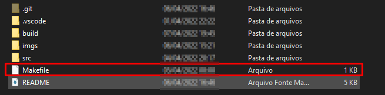
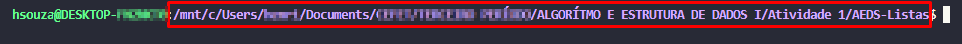
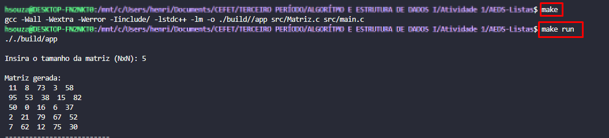

# Makefile-para-C

<h1>Como utilizar</h1>

<b>1º Insira o arquivo <code>Makefile</code> na pasta ⇣</b>

    

É importante lembrar que, para esse makefile funcionar, seus arquvios '.c' deverão em uma pasta <code> /'src'</code>, mas você pode apenas alterar no makefile o nome da sua pasta. *LINHA 9*

<b>2º Certifique-se, pelo endereço indicado, que o terminal está rodando na pasta correta ⇣</b>

    

<b>Caso o endereço não corresponda ao desejado, você pode navegar pelas pastas utilizando 'ls' para se localizar e 'cd /endereco' para ir direto a um diretório.</b>

<b>3º Estando na pasta correta, é só digitar '<code>make</code>' seguido de '<code>make run</code>' para o programa compilar ⇣</b>

    

OBS: extremamente recomendável aplicar um '<code>make clean</code>' antes de compilar depois da primeira vez!

<h2>Espero ter ajudado</h2>
